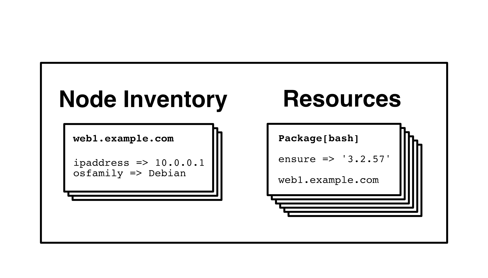

footer: Rich Burroughs, Daniel Parks - Puppet SRE
slidenumbers: true
theme: Zurich, 5

[.footer: ]
[.slidenumbers: false ]
# What Are You Running? PuppetDB Knows.

## Rich Burroughs, Daniel Parks
## Puppet SRE

### http://bit.ly/2uetA88

^ We're the team at Puppet that runs Puppet

---



---

## How do I get it?
- Included with Puppet Enterprise
- Open source users can use the puppetlabs/puppetdb module to install and manage it

---

## Puppet Query Language (PQL)

---

# Node Inventory

fact      | value
----------|----------------------
certname  | web1-prod.example.com
ipaddress | 10.0.0.1
os.family | Debian

---

```Ruby
# Get information about nodes (hosts)
inventory {

  # Only nodes where the certname (FQDN) contains "prod"
  certname ~ "prod"

  # and the OS is Debian
  and facts.os.name = "Debian"
}
```

---
```Ruby
$ puppet query 'inventory { certname ~ "prod"
                            and facts.os.name = "Debian" }'
[
  {
    "certname": "web1-prod.example.com",
    "timestamp": "2017-03-22T19:36:20.095Z",
    "facts": {
      "ipaddress": "10.0.0.1",
      "memoryfreeinbytes": "1766612992",
      "os": {
        "name": "Debian",
        . . .
```
---

# Resources

```Puppet
class profile::database ( $password ) {
  # This is a resource:
  postgresql::server::db { 'myapp_database':
    user     => 'myapp',
    password => $password,
  }
}
```

---
^ Returns file and line number where the resource is defined
^ Includes all parameters for the resource, including the ones that aren't directly specified and come from defaults or hiera

```Ruby
$ puppet query 'resources { type = "Postgresql::Server::Db" }'
[
  {
    "certname": "db1-prod.example.com",
    "file": ". . ./profile/manifests/database.pp",
    "line": 3,
    "title": "myapp_database",
    "parameters": {
      "user": "myapp",
      "grant": "ALL",
      . . .
```

---

```Ruby
$ puppet query 'resources { type = "Postgresql::Server::Db" }'
[
  {
    "certname": "db1-prod.example.com",
    "file": ". . ./profile/manifests/database.pp",
    "line": 3,
    "title": "myapp_database",
    "parameters": {
      "user": "myapp",
      "grant": "ALL",
      . . .
```

---

```Ruby
$ puppet query 'resources[certname,title]
  { type = "Class" and title ~ "Role::" }'
[
  {
    "certname": "web1-prod.example.com",
    "title": "Role::Web"
  },
  {
    "certname": "db1-prod.example.com",
    "title": "Role::Db"
  },
  . . .
```
---

## Queries in Puppet Code

^ We can also PQL in Puppet code. We often use this instead of exported resources.

---

^ Here's an example of setting up hosts in our Icinga2 monitoring system.
^ We query for all nodes and create a host resource for them based on facts defined for each node.

```Puppet
puppetdb_query('inventory {}').each |$node| {
  $period = 'allhours'


  icinga2::object::host { $node['certname']:
    ipv4_address => $node['facts']['ipaddress'],
    vars         => {
      'owner'               => $node['facts']['owner'],
      'notification_period' => $period,
    },
  }
}
```
---

^ Here's an advantage over exported resources.
^ If I want to test a change to the host object, I only have to run puppet on the master node instead of running it on the host and then then master.

```Puppet
puppetdb_query('inventory {}').each |$node| {
  $period = $node['trusted']['hostname'] ? {
    /-prod$/  => 'allhours',
    /-stage$/ => 'workhours',
  }

  icinga2::object::host { $node['certname']:
    ipv4_address => $node['facts']['ipaddress'],
    vars         => {
      'owner'               => $node['facts']['owner'],
      'notification_period' => $period,
    },
  }
}
```

---

## REST API

^ Can access via HTTP or HTTPS
^ If you use as part of PE, you can use RBAC auth tokens

---

^ Python's Requests library is great
^ Can also use libraries for other languages that do HTTP, like Ruby's rest-client


---

```Python
import requests

url = "http://httpbin.org/ip"
r = requests.get(url)
print(r.txt)
```

---


```Python
def get_nodes():
    nodes = []
    url = "http://localhost:8080/pdb/query/v4/nodes"
    r = requests.get(url)
```

---

```Python
def get_nodes():
    nodes = []
    url = "http://localhost:8080/pdb/query/v4/nodes"
    r = requests.get(url)
    response = json.loads(r.text)
    for i in response:
        nodes.append(i['certname'])
    return nodes
```

---
## In conlusion:

- PuppetDB contains info about resources and nodes
- PQL to query at the command line
- Query in your Puppet code
- Tooling that you write that interacts with the API
