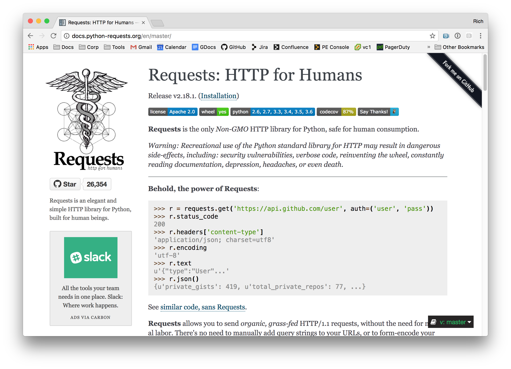

footer: Rich Burroughs, Daniel Parks - Puppet SRE
slidenumbers: true

[.footer: ]
[.slidenumbers: false ]
# What Are You Running? PuppetDB Knows.

## Rich Burroughs, Daniel Parks
## Puppet SRE

### http://bit.ly/2uetA88
---

## What is PuppetDB?
> "PuppetDB collects data generated by Puppet. It enables advanced Puppet features like exported resources, and can be the foundation for other applications that use Puppet’s data."

---

## How do I get it?
- Included with Puppet Enterprise
- Open source users can use the puppetlabs/puppetdb module to install and manage it

```Puppet
class profile::puppetdb {
  # Configure puppetdb and its underlying database
  include puppetdb
  # Configure the Puppet master to use puppetdb
  include puppetdb::master::config
}
```

---

## Puppet Query Language (PQL)

---
```Ruby
inventory { certname ~ "^web" and facts.os.family = "Debian" }
[
  {
    "certname": "web1.example.com",
    "timestamp": "2017-03-22T19:36:20.095Z",
    "environment": "production",
    "facts": {
      "memoryfreeinbytes": "1766612992",
      "os": {
        "name": "Debian",
        "distro": {
          "id": "Debian",
          "release": {
            "full": "8.7",
            "major": "8",
            "minor": "7"
          },
          . . .
```
---
```Ruby
resources { certname ~ "^db" and type = "Postgresql::Server::Database" }
```
---

```Ruby
$ puppet query 'reports[certname,receive_time,environment]
  { certname = "lb2.example.com" and latest_report? = true }'

[
  {
    "certname": "lb2.example.com",
    "receive_time": "2017-07-21T23:04:11.932Z",
    "environment": "production"
  }
]
```
---

## Queries in Puppet Code

---

``` puppet
puppetdb_query('inventory {}').each |$node| {
  sshkey { $node['facts']['fqdn']:
    key          => $node['facts']['ssh']['rsa']['key'],
    host_aliases => [$node['facts']['ipaddress']],
    type         => 'ssh-rsa',
  }
}
```
---

## Service Discovery

^ We use this pattern at Puppet a lot
^ for things like populating load balancers
^ and configuring monitoring

---

```puppet
puppetdb_query('inventory[certname] { certname ~ "^web" }').each |$node| {
  haproxy::balancermember { $node['facts']['fqdn']:
    listening_service => 'www',
    server_names      => $node['facts']['fqdn'],
    ipaddresses       => $node['facts']['ipaddress'],
    ports             => '80',
  }
}
```

---

## REST API

^ Can access via HTTP or HTTPS
^ If you use as part of PE, you can use RBAC auth tokens

---

^ Python's Requests library is great
^ Can also use libraries for other languages that do HTTP, like Ruby's rest-client



---

```Python
def get_nodes():
    nodes = []
    url = "http://localhost:8080/pdb/query/v4/nodes"
    r = requests.get(url)
    response = json.loads(r.text)
    for i in response:
        if not i['deactivated'] and not i['expired']:
            nodes.append(i['certname'])
    return nodes
```

---

```Python
def get_fact(certname, fact):
    url = "http://localhost:8080/pdb/query/v4/nodes/{}/facts/{}".format(certname, fact)
    r = requests.get(url)
    response = json.loads(r.text)
    for i in response:
        result = i['value']
        return result
```

---

```Python
def main():
    get_nodes()
    for node in nodes:
        operatingsystem = get_fact(node, 'operatingsystem')
        operatingsystemrelease = get_fact(node, 'operatingsystemrelease')
        kernelversion = get_fact(node, 'kernelversion')
```
