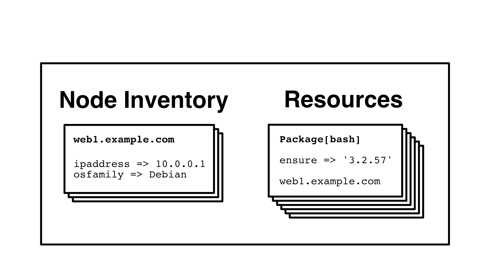
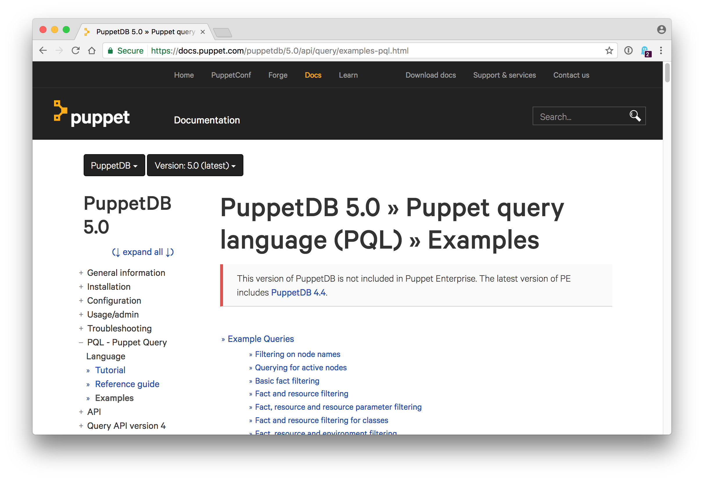
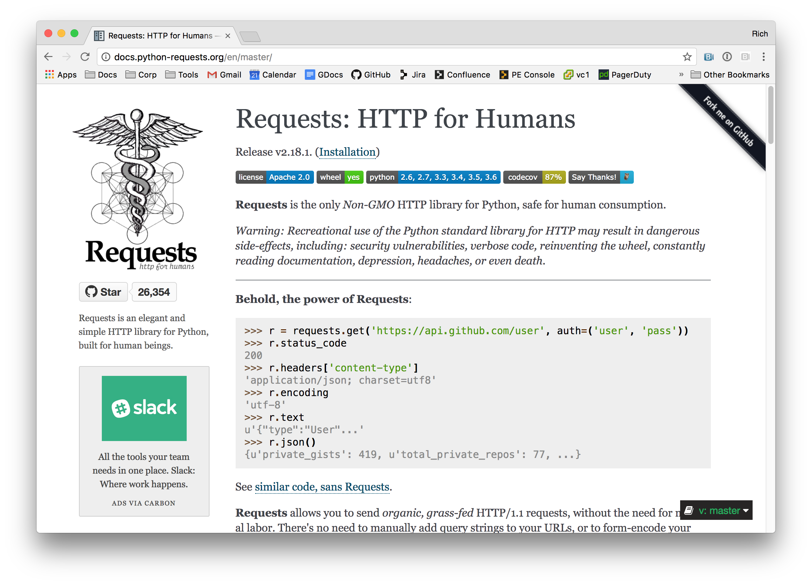

footer: Rich Burroughs, Daniel Parks - Puppet SRE
slidenumbers: true
theme: Zurich, 5

[.footer: ]
[.slidenumbers: false ]
# What Are You Running? PuppetDB Knows.

## Rich Burroughs, Daniel Parks
## Puppet SRE

### https://github.com/richburroughs/puppetdb_ignite

^ We're the team at Puppet that runs Puppet

---



^ **D:** Puppet has stored all this information for you. You get it out with Puppet Query Language, or PQL for short.

^ **D:** With PQL you specify what kind of data you want — say node inventory or resources — and then a filter on that data.

---

## How do I get it?
- Included with Puppet Enterprise
- Open source users can use the puppetlabs/puppetdb module to install and manage it

---

## Puppet Query Language (PQL)

---

# Node Inventory

fact      | value
----------|----------------------
certname  | web1-prod.example.com
ipaddress | 10.0.0.2
os.family | Debian

^ **D:** As Rich said, Puppet automatically collects a bunch facts about all of your nodes and then stores that in the node inventory.

^ **D:** Two points of clarification:

^ **D:** By "nodes" I mean servers or virtual machines.

^ **D:** And, certname is a puppet thing; it's generally equivalent to the hostname.

---

```Ruby
# Get information about nodes (hosts)
inventory {

  # Only nodes where the certname (FQDN) contains "prod"
  certname ~ "prod"

  # and the OS is Debian
  and facts.os.name = "Debian"
}
```

^ **D:** Here's some PQL. We're querying inventory, and we only want nodes that both have "prod" in their hostname, and that are running Debian. As you can see, the syntax is pretty simple.

---
```Ruby
$ puppet query 'inventory { certname ~ "prod"
                            and facts.os.name = "Debian" }'
[
  {
    "certname": "web1-prod.example.com",
    "timestamp": "2017-03-22T19:36:20.095Z",
    "facts": {
      "ipaddress": "10.0.0.2",
      "memoryfreeinbytes": "1766612992",
      "os": {
        "name": "Debian",
        . . .
```

^ **D:** Here are the abbreviated results of that query. You can see that it found a node called `web1-prod`, that it has an IP address, that it has about one and a half gigs of memory free, and so on.

^ **D:** Of course, depending on your query, this could return multiple nodes.

---

# Resources

```Puppet
class profile::database ( $password ) {
  # This is a resource:
  postgresql::server::db { 'myapp_database':
    user     => 'myapp',
    password => $password,
  }
}
```

^ **D:** Let's move on to resources.

^ **D:** Resources are "things" on a server. A package, a file, or something more complex like a Postgres database. This is what the puppet code to define a Postgres DB looks like.

^ **D:** Of course, you can query resources just like node inventory.

---
```Ruby
$ puppet query 'resources { type = "Postgresql::Server::Db" }'
[
  {
    "certname": "db1-prod.example.com",
    "file": ". . ./profile/manifests/database.pp",
    "line": 3,
    "title": "myapp_database",
    "parameters": {
      "user": "myapp",
      "grant": "ALL",
      . . .
```

^ **D:** The PQL structure is pretty similar. We're querying resources, and we only want ones with the type `postgresql::server::db`.

^ **D:** That's gonna return a *bunch* of useful information about each instance of the resource. It tells you what node it's on, all of its parameters, as well as the file and line number where it's defined in your puppet code. Super useful for debugging.

^ **D:** It's also great for ad hoc testing. Let's say I change a resource; I can go to PuppetDB and find out exactly which nodes will be affected by the change.

---

```Ruby
$ puppet query 'resources { type = "Postgresql::Server::Db" }'
[
  {
    "certname": "db1-prod.example.com",
    "file": ". . ./profile/manifests/database.pp",
    "line": 3,
    "title": "myapp_database",
    "parameters": {
      "user": "myapp",
      "grant": "ALL",
      . . .
```

---

```Ruby
$ puppet query 'resources[certname,title]
  { type = "Class" and title ~ "Role::" }'
[
  {
    "certname": "web1-prod.example.com",
    "title": "Role::Web"
  },
  {
    "certname": "db1-prod.example.com",
    "title": "Role::Db"
  },
  . . .
```

^ **D:** The standard practice in puppet is to give each node a "role", like "web" or "db". Here's a simple query that returns every node in your infrastructure along with the role assigned to it.

---



^ **D:** Alright. To learn more, head over to docs.puppet.com and look at the PQL examples. There's also a tutorial and a reference, but I think the examples are a better place to start. Unfortunately I didn't put the URL on here… so you gotta Google.

---

## Queries in Puppet Code

^ **D:** I want to take a little detour here and point out that you can query PuppetDB from your Puppet code. It's useful when, say, you want to automatically define backends for your load balancer, or configure monitoring to watch all your hosts.

^ We often use this instead of exported resources.

---

```Puppet
# Find load balancer members
puppetdb_query('inventory { certname ~ "^web.*-prod" }').each |$node| {
  haproxy::balancermember { $node['facts']['fqdn']:
    listening_service => 'www',
  }
}

# Create icinga2 host objects for all nodes in inventory
puppetdb_query('inventory {}').each |$node| {
  icinga2::object::host { $node['certname']:
    'ipv4_address' => $node['facts']['ipaddress'],
  }
}
```

^ **D:** It's pretty simple. You pass some PQL to the function `puppetdb_query`, and it returns an array of objects. You can iterate over that and define resources.

^ Here's an example of setting up hosts in our Icinga2 monitoring system.

^ We query for all nodes and create a host resource for them based on facts defined for each node.

---

## REST API

^ Can access the API via HTTP or HTTPS

^ If you use it as part of Puppet Enterprise, you can use RBAC auth tokens

---



^ Python's Requests library is great

^ Can also use libraries for other languages that do HTTP, like Ruby's rest-client

---

```Python
>>> import requests
>>> url = "http://httpbin.org/ip"
>>> r = requests.get(url)
>>> print(r.text)
{
  "origin": "10.0.0.1"
}
```

---


```Python
def get_nodes():
    nodes = []
    url = "http://localhost:8080/pdb/query/v4/nodes"
    r = requests.get(url)
```

---

```Python
def get_nodes():
    nodes = []
    url = "http://localhost:8080/pdb/query/v4/nodes"
    r = requests.get(url)
    response = json.loads(r.text)
    for i in response:
        nodes.append(i['certname'])
    return nodes
```

---


^ **D:** So that's PuppetDB. Please come and ask us questions, or hit us up on BlueSky: @richburroughs.dev, @daniel-parks.bsky.social

^ **D:** We also have the repo that defines these slides up on GitHub.
